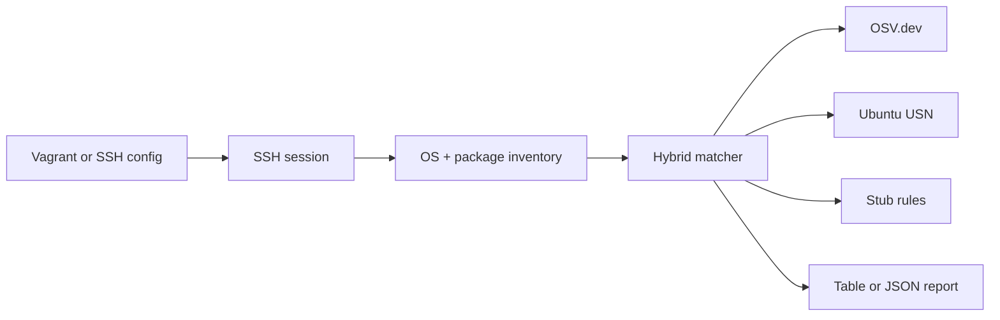

# BoxGuard

[](LICENSE)
[](https://go.dev/dl/)

**Inventory Linux packages over SSH, then match them against [OSV.dev](https://osv.dev/), Ubuntu USN, and local stub rules — from a single CLI.**

BoxGuard targets **Vagrant-managed machines** (it reads `vagrant ssh-config`) or **any host** you can reach with SSH and a private key. Use it for quick security posture checks on dev boxes, CI images, or lab VMs.

---

## Contents

- [Features](#features)
- [How it works](#how-it-works)
- [Requirements](#requirements)
- [Install](#install)
- [Usage](#usage)
- [CLI reference](#cli-reference)
- [Output](#sample-output)
- [Data sources](#data-sources)
- [Local test environment](#local-test-environment-vagrant)
- [Project layout](#project-layout)
- [Security notes](#security-notes)
- [Development](#development)
- [Contributing](#contributing)
- [License](#license)

---

## Features

| Area | What BoxGuard does |
|------|-------------------|
| **Discovery** | Reads `/etc/os-release`, lists packages via `dpkg-query` or `rpm` |
| **Matching** | OSV queries for curated packages, Ubuntu USN RSS on Ubuntu, plus stub fallbacks |
| **Reporting** | Human-readable **table** or machine-readable **JSON** (`-o json`) |

---

## How it works



Each scan run uses a **2-minute** overall timeout (see `cmd/scan.go`).

---

## Requirements

| Tool | Notes |
|------|--------|
| **Go** | 1.22+ ([`go.mod`](go.mod)) |
| **Target** | Linux with SSH; key-based auth as configured in code |
| **Vagrant** | Optional — only if you use `--vagrant-path` |

The bundled [`Vagrantfile`](Vagrantfile) uses the **Docker** provider and Ubuntu 18.04 for local CVE regression demos (pinned packages). Adjust for your environment.

---

## Install

```bash
git clone <repository-url> boxguard
cd boxguard
go mod tidy
go build -o boxguard .
```

Or use the [`Makefile`](Makefile):

```bash
make build    # produces ./boxguard
make test     # go test ./...
```

---

## Usage

### Vagrant

```bash
./boxguard scan --vagrant-path .

# Named machine (multi-machine Vagrantfile)
./boxguard scan --vagrant-path . --vagrant-machine web-server
```

### Direct SSH

```bash
./boxguard scan \
  --ssh-host 192.168.1.100 \
  --ssh-user ubuntu \
  --ssh-key ~/.ssh/id_rsa

# Non-default port
./boxguard scan --ssh-host 10.0.0.5 --ssh-user deploy --ssh-key ~/.ssh/id_ed25519 --ssh-port 2222
```

### Output format

```bash
./boxguard scan --vagrant-path .              # table (default)
./boxguard scan --vagrant-path . -o json      # JSON
```

Global flags: `-o, --output` (`table` \| `json`), `-v, --verbose`.

---

## CLI reference

### `boxguard scan`

| Flag | Description |
|------|-------------|
| `--vagrant-path` | Directory containing a `Vagrantfile` |
| `--vagrant-machine` | Machine name when using multi-machine setups |
| `--ssh-host` | Remote host (use with `--ssh-user` and `--ssh-key`) |
| `--ssh-user` | SSH username |
| `--ssh-key` | Path to private key |
| `--ssh-port` | SSH port (default: `22`) |

You must specify either **Vagrant** (`--vagrant-path` and/or `--vagrant-machine`) **or** **`--ssh-host`** with user and key.

---

## Sample output

```
OS: Ubuntu 18.04 LTS (ID=ubuntu, VERSION_ID=18.04)

+------+---------+-----------------+----------------------+-------------------+-----+--------+------+
| SEV  | PKG     | VERSION         | VULN                 | TITLE             | FIX | SOURCE | CVSS |
+------+---------+-----------------+----------------------+-------------------+-----+--------+------+
| HIGH | openssl | 1.1.0g-2ubuntu4 | CVE-2021-3711        | OpenSSL: SM2 decryption | 1.1.1l | osv    | 7.5  |
| HIGH | sudo    | 1.8.21p2-3      | CVE-2021-3156        | sudo: heap-based buffer overflow | 1.9.5p1 | osv    | 7.0  |
+------+---------+-----------------+----------------------+-------------------+-----+--------+------+

Packages: 171, Findings: 2
Stub findings: 0
OSV findings: 2
```

---

## Data sources

- **[OSV.dev](https://osv.dev/)** — Aggregated advisories (CVE, GHSA, etc.) with CVSS where available.
- **Ubuntu USN** — RSS feed from Ubuntu security notices (used when `ID=ubuntu` in `/etc/os-release`).
- **Stub database** — Small in-repo rules for demonstration when live data does not apply.

---

## Local test environment (Vagrant)

Optional scripts for the Docker-based Ubuntu 18.04 box:

```bash
./test-cves.sh
./debug-scan.sh
vagrant destroy -f && vagrant up   # rebuild VM
```

---

## Project layout

```
cmd/              CLI (Cobra): root + scan
internal/util/    Version metadata
pkg/inventory/    OS detection, dpkg/rpm listing
pkg/model/        Shared structs
pkg/report/       Table and JSON reporters
pkg/sources/      Vagrant ssh-config + SSH runner
pkg/vuln/         Stub DB, OSV, USN, hybrid matcher
```

---

## Security notes

- SSH host keys are **not** verified by default (`InsecureIgnoreHostKey` in the SSH client). Use only in trusted networks or extend the client for host key pinning / `known_hosts`.
- Matching uses **heuristics** (package names, simple version compare). Treat output as **indicative**, not a substitute for full VM image scanning or distro security teams’ guidance.

---

## Development

**Add a vulnerability source:** implement logic under `pkg/vuln/`, then integrate with `HybridMatcher` in [`pkg/vuln/hybrid.go`](pkg/vuln/hybrid.go).

**Add OS support:** extend [`pkg/inventory/`](pkg/inventory/) for detection and package listing, and adjust OSV ecosystem mapping in [`pkg/vuln/osv.go`](pkg/vuln/osv.go) if needed.

---

## Contributing

1. Fork the repo and create a branch (`feature/…` or `fix/…`).
2. Run `make test` (or `go test ./...`).
3. Open a Pull Request with a clear description of behavior changes.

---

## License

Released under the [MIT License](LICENSE).
